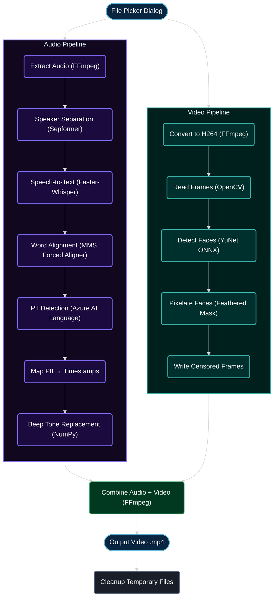

# Redactify

## Table of Contents

- [1.1. Workflow Diagram](#Workflow-Diagram)
- [1.2. Flow Explanation](#Flow-Explanation)
- [1.3. Limitations](#Limitations)
- [1.4. Setup](#Setup)
  - [1.4.1. Prerequisites](#Prerequisites)
  - [1.4.2. Install Dependencies](#Install-Dependencies)
  - [1.4.3. Environment](#Environment)
  - [1.4.4. Run](#Run)
- [1.5. Future Changes](#Future-Changes)

A solution that automatically detects and censors **PII** in **audio** and **video**. Faces are pixelated and spoken PII is replaced with a beep tone.

---

## Workflow Diagram



---

## Flow Explanation

| Step | Description |
|------|-------------|
| **1. File Selection** | If no `input_path` argument is given, a `crossfiledialog` file picker prompts for the source video. |
| **2. Parallel Fork** | Two threads are started immediately. Each thread handles its own FFmpeg pre-processing step as its first action: the audio thread extracts the audio track to `input/.wav`; the video thread re-encodes to H264 (lossless, CRF 0) into `input/.mp4`. |
| **3. Speaker Separation** | [Sepformer](https://huggingface.co/speechbrain/sepformer-whamr16k) decomposes the audio into individual speaker channels, improving downstream transcription accuracy in multi-speaker scenarios. |
| **4. Speech-to-Text** | [Faster-Whisper](https://github.com/SYSTRAN/faster-whisper) (`large-v3`) transcribes each speaker channel with word-level timestamps. Auto-detects language from several supported languages. |
| **5. Word Alignment** | PyTorch's [MMS Forced Aligner](https://pytorch.org/audio/stable/tutorials/forced_alignment_tutorial.html) refines Whisper's timestamps producing tighter intervals for each spoken word. |
| **6. PII Detection** | The full transcript is sent to **Azure AI Language** for PII recognition. Large transcripts are automatically chunked to respect the API's limit. |
| **7. Timestamp Mapping** | Detected PII text spans are matched back to the aligned word timestamps, producing a list of audio time ranges to be censored. |
| **8. Audio Censoring** | A configurable sine wave beep (1000Hz default) replaces each PII time span in the `.wav` file, with a configurable padding (default ±0.1 s) before and after the boundary. |
| **9. Face Detection** | Each video frame is passed through [OpenCV's YuNet](https://github.com/opencv/opencv_zoo/tree/main/models/face_detection_yunet) ONNX detector (CUDA-accelerated when available). Bounding boxes are returned per frame. |
| **10. Face Censoring** | Each detected face region and its configured margin is decimated and overlayed onto the original frame with a configurable feathering effect. |
| **11. Recombine** | FFmpeg combines the censored audio and video back into a single `.mp4` file. |
| **12. Cleanup** | All intermediate files in `input/` and `intermediate/` are removed. |

---

## Limitations

| Area | Limitation |
|------|-----------|
| **Transcript Accuracy** | PII detection depends on transcription quality. Background noise, heavy accents, or overlapping speech can reduce accuracy. |
| **Face detection** | YuNet performs best on frontal, well-lit faces. Small, heavily rotated, or partially occluded faces may be missed. |
| **Speaker separation limit** | Sepformer is trained for 2-speaker separation; 3+ speaker scenarios may degrade quality. |
| **Alignment Number Issue** | Spoken numbers over one digit will not get aligned by [MMS Forced Aligner](https://pytorch.org/audio/stable/tutorials/forced_alignment_tutorial.html). |

---

## Setup

### Prerequisites

- Python 3.13
- UV
- FFmpeg on `PATH`
- CUDA 12.8 compatible GPU (optional, CPU fallback available)
- Azure AI Language resource

### Install Dependencies

```bash
uv sync
```

> PyTorch is sourced from the CUDA 12.8 index; OpenCV is sourced from a CUDA-enabled GitHub wheel. Both are configured automatically via `pyproject.toml`.

### Environment

Create a `.env` file in the project root:

```env
PIIDETECTOR_TAC_ENDPOINT="https://<your-resource>.cognitiveservices.azure.com/"
PIIDETECTOR_TAC_KEY="<your-key>"
HF_TOKEN="<huggingface-token>"
MODELS_DIRECTORY="./models"
WORKING_DIRECTORY="path\\to\\working\\directory"
```

| Variable | Purpose |
|----------|---------|
| `PIIDETECTOR_TAC_ENDPOINT` | Azure AI Language resource endpoint |
| `PIIDETECTOR_TAC_KEY` | Azure AI Language API key |
| `HF_TOKEN` | Hugging Face token, required to download Sepformer and Pyannote models on first run |
| `MODELS_DIRECTORY` | Local path where downloaded models are cached |
| `WORKING_DIRECTORY` | Working directory. The pipeline uses three subdirectories: `input/` for normalised pre-processed files, `intermediate/` for intermediate censored tracks, and `output/` for the final redacted video. |

### Run

```bash
uv run src/main.py [input_path] [output_path] [options]
```

`input_path` and `output_path` are both optional. If `input_path` is omitted a file picker dialogue opens. If `output_path` is omitted the result is written to `<WORKING_DIRECTORY>/output/<filename>.mp4`.

| Option | Default | Description |
|--------|---------|-------------|
| `--device {auto,cpu,cuda}` | `auto` | Compute device for ML models |
| `--compute-type {auto,float16,int8}` | `auto` | Whisper weight precision |
| `--whisper-model MODEL` | `large-v3` | Faster-Whisper model name |
| `--language LANG` | auto-detect | BCP-47 language code for transcription |
| `--asr-batch-size N` | — | Whisper inference batch size |
| `--alignment-padding SECS` | — | Extra context window passed to MMS aligner |
| `--censor-frequency HZ` | `1000` | Beep tone frequency |
| `--censor-amplitude AMP` | — | Beep tone amplitude (0–1) |
| `--censor-padding SECS` | `0.1` | Silence padding added before/after each beep |
| `--fd-score-threshold F` | — | YuNet face detection confidence threshold |
| `--fd-nms-threshold F` | — | YuNet NMS IoU threshold |
| `--fd-top-k N` | — | Maximum number of faces detected per frame |
| `--blur-expansion F` | — | Bounding-box expansion factor for face blur region |
| `--blur-feather-inner F` | — | Inner feather radius (fraction of region size) |
| `--blur-feather-outer F` | — | Outer feather radius (fraction of region size) |
| `--blur-downsample-resolution N` | — | Pixelation grid resolution |

**Examples**

```bash
# GUI file picker, default output path
uv run src/main.py

# Explicit paths
uv run src/main.py footage.mp4 redacted.mp4

# Force CPU, custom beep frequency
uv run src/main.py footage.mp4 --device cpu --censor-frequency 800
```

---

## Future Changes

| Change | Description |
|--------|-------------|
| **Azure Batch** | Move the processing pipeline to Azure Batch so large volumes of videos can be queued and processed in parallel across multiple nodes, enabling automated, scalable execution without manual intervention. |
| **Azure Blob Storage integration** | Accept input files from an Azure Blob Storage container and write outputs back, removing the dependency on local file paths and enabling cloud-native workflows. |
| **OpenCV Cuda Optimisation** | Current CUDA implementation of blurring is primitive and lacks features. |
| **Censoring Technique** | Add gaussian blur to censored objects for a more professional look. |
| **Video PII Detection** | Add detection for objects that may contain PII such as ID and credit cards. |
| **CLI enhancements** | Add sub-commands (e.g. `audio-only`, `video-only`) and richer progress reporting. |
| **API interface** | Expose a REST endpoint via FastAPI for on-demand processing. |
| **Redaction report** | Generate a structured JSON or PDF report listing all detected PII entities, their categories, confidence scores, and timestamps. |
| **Containerisation** | Package the full stack as a Docker image with CUDA base to simplify deployment and eliminate the manual FFmpeg / Python version constraints. |
| **Application Insights integration** | Send telemetry to Azure Application Insights. |